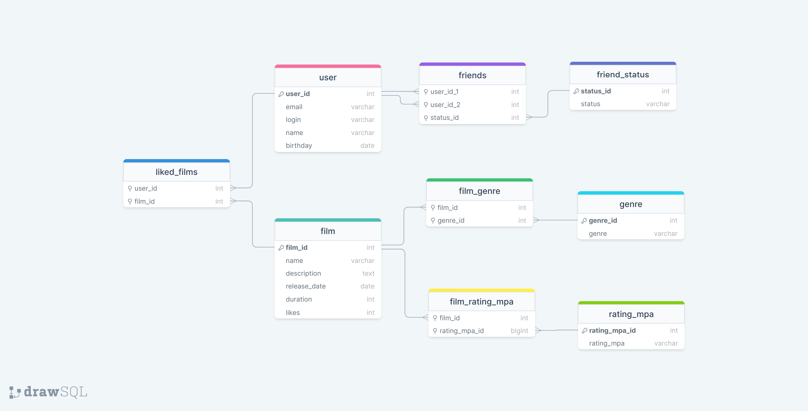

# java-filmorate

Проект курса Yandex Practicum.

### Схема базы данных


### Примеры запросов:

Получение конкретного пользователя по id пользователя:
```SQL
SELECT * 
FROM user
WHERE user_id = [id];
```

Получение всех фильмов которым пользователь с id поставил лайк:
```SQL
SELECT * 
FROM liked_films AS lf
LEFT INNER JOIN film AS f ON f.film_id = lf.film_id
WHERE lf.user_id = [id];
```

Получение всех друзей пользователя с id:
```SQL
SELECT user_id_2 AS friends
FROM friends
WHERE user_id_1 = [id] 
AND status = 'confirmed'
AND user_id_2 in (
    SELECT user_id_1
    FROM friends
    WHERE user_id_2 = [id]
    AND status = 'confirmed'
);
```

Получение всех запросов на дружбу к пользователю с id:
```SQL
SELECT user_id_2 AS friends
FROM friends
WHERE user_id_1 = [id] 
AND status = 'unconfirmed'
AND user_id_2 in (
    SELECT user_id_1
    FROM friends
    WHERE user_id_2 = [id]
    AND status = 'confirmed'
);
```

Получение всех запросов на дружбу от пользователя с id:
```SQL
SELECT user_id_2 AS friends
FROM friends
WHERE user_id_1 = [id] 
AND status = 'confirmed'
AND user_id_2 in (
    SELECT user_id_1
    FROM friends
    WHERE user_id_2 = [id]
    AND status = 'unconfirmed'
);
```

